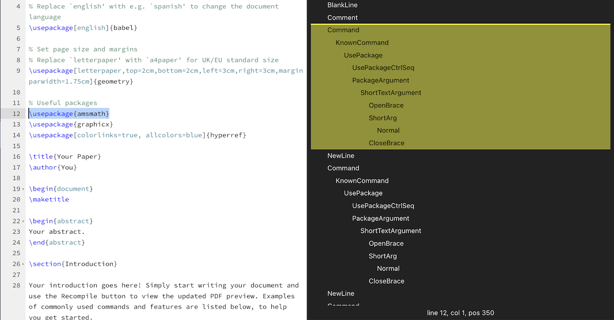

# @overleaf/codemirror-tree-view

A CodeMirror 6 extension providing an interactive view of a document's syntax tree



## Usage

```ts
import { treeView } from '@overleaf/codemirror-tree-view'
```
